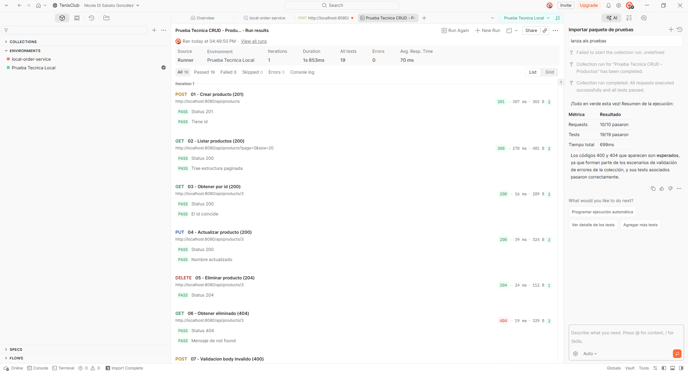
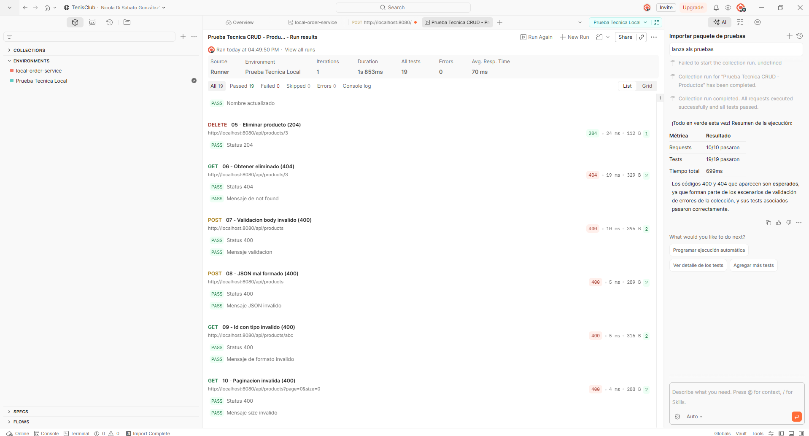

# prueba-tecnica-Nicola-Di-Sabato

API CRUD de productos (solo backend) con Java 17, Spring Boot, MySQL y Flyway.

Documento resumido para evaluador:
- `DOCUMENTO_ENTREGA_EVALUADOR.md`

## Objetivo

Implementar una API REST que permita crear, consultar, actualizar y eliminar productos,
con validaciones, manejo de errores y migraciones reproducibles desde cero.

## Stack tecnico

- Java 17
- Spring Boot 3.5
- Spring Web
- Spring Validation
- Spring Data JPA
- Flyway
- MySQL 8
- JUnit 5, Mockito, MockMvc, Testcontainers

## Estructura del proyecto

```text
.
├── docker-compose.yml
├── DOCUMENTO_ENTREGA_EVALUADOR.md
├── README.md
└── prueba/
  ├── pom.xml
  ├── mvnw
  ├── mvnw.cmd
  ├── GUIA_ENTREVISTA.md
  ├── GUIA_FLYWAY_PASO_A_PASO.md
  ├── postman/
  │   ├── PruebaTecnica.postman_collection.json
  │   └── PruebaTecnica.local.postman_environment.json
  ├── scripts/
  │   └── verificacion-entrevista.ps1
  └── src/
    ├── main/
    │   ├── java/com/prueba_tecnica_nicola/prueba/
    │   │   ├── PruebaApplication.java
    │   │   ├── common/
    │   │   │   └── infrastructure/
    │   │   │       ├── config/
    │   │   │       └── exception/
    │   │   └── product/
    │   │       ├── domain/
    │   │       ├── application/
    │   │       │   ├── port/in/
    │   │       │   ├── port/out/
    │   │       │   └── service/
    │   │       └── infrastructure/
    │   │           ├── adapter/in/web/
    │   │           └── adapter/out/persistence/
    │   └── resources/
    │       ├── application.properties
    │       └── db/migration/
    │           └── V1__create_product_table.sql
    └── test/
      └── java/com/prueba_tecnica_nicola/prueba/
        ├── product/application/service/
        ├── product/infrastructure/adapter/in/web/
        └── infrastructure/database/
```

### Mapa rapido de responsabilidades

| Carpeta | Rol principal |
|---|---|
| `product/domain` | Modelo de dominio y excepciones de negocio |
| `product/application/port` | Contratos de entrada y salida (hexagonal) |
| `product/application/service` | Casos de uso y reglas de negocio |
| `product/infrastructure/adapter/in/web` | API REST, DTOs y mapeo web |
| `product/infrastructure/adapter/out/persistence` | Persistencia JPA y mapeo dominio-entidad |
| `common/infrastructure/exception` | Manejo global y formato uniforme de errores |
| `resources/db/migration` | Versionado de esquema con Flyway |
| `src/test` | Pruebas unitarias, de contrato HTTP e integración |

## Alcance de la prueba

Incluido:
- CRUD completo de productos
- Validaciones de negocio y de entrada
- Manejo de errores 400, 404 y 500
- Migraciones Flyway
- Tests unitarios e integracion

Fuera de alcance (segun enunciado):
- Autenticacion y autorizacion (JWT, OAuth)
- Frontend
- Deploy a ambientes remotos
- Documentacion exhaustiva

## Como levantar el proyecto

1. Levantar MySQL local:
```powershell
docker compose up -d
```

2. Entrar al modulo backend:
```powershell
cd prueba
```

3. Ejecutar tests:
```powershell
.\mvnw.cmd test
```

4. Levantar la aplicacion:
```powershell
.\mvnw.cmd spring-boot:run
```

## Pruebas automaticas

Comando:
```powershell
cd prueba
.\mvnw.cmd test
```

Incluye:
- tests de servicio
- tests de controlador
- test de integracion de migraciones Flyway sobre MySQL vacio

## Pruebas manuales (Postman o curl)

Pack de Postman listo para importar:
- `prueba/postman/PruebaTecnica.postman_collection.json`
- `prueba/postman/PruebaTecnica.local.postman_environment.json`

### Evidencias visuales (Postman)

Ejecucion del runner con requests y tests en verde:





Base URL:
```text
http://localhost:8080/api/products
```

1. Crear producto (201):
```bash
curl -X POST http://localhost:8080/api/products \
  -H "Content-Type: application/json" \
  -d "{\"name\":\"Teclado\",\"description\":\"Mecanico\",\"price\":99.90,\"stock\":8}"
```

2. Listar productos (200):
```bash
curl "http://localhost:8080/api/products?page=0&size=20"
```

3. Consultar por id existente (200):
```bash
curl "http://localhost:8080/api/products/1"
```

4. Actualizar producto (200):
```bash
curl -X PUT http://localhost:8080/api/products/1 \
  -H "Content-Type: application/json" \
  -d "{\"name\":\"Teclado Pro\",\"description\":\"Mecanico RGB\",\"price\":109.90,\"stock\":10}"
```

5. Eliminar producto (204):
```bash
curl -X DELETE http://localhost:8080/api/products/1
```

6. Caso de error de validacion (400):
```bash
curl -X POST http://localhost:8080/api/products \
  -H "Content-Type: application/json" \
  -d "{\"name\":\"\",\"price\":0,\"stock\":-1}"
```

## Migraciones desde cero

La aplicacion usa Flyway y `ddl-auto=validate` para asegurar consistencia entre
modelo y base de datos. La migracion actual crea la tabla `product`.

Ademas hay un test de integracion que valida migracion sobre esquema vacio:
- `prueba/src/test/java/com/prueba_tecnica_nicola/prueba/infrastructure/database/FlywayMigrationIntegrationTest.java`

Guia manual paso a paso para repetir la prueba de Flyway por tu cuenta:
- `prueba/GUIA_FLYWAY_PASO_A_PASO.md`

## Script de verificacion rapida

Para validar todo antes de una demo:

```powershell
powershell -NoProfile -ExecutionPolicy Bypass -File .\prueba\scripts\verificacion-entrevista.ps1
```

## Guia de entrevista

Para checklist final, guion y simulacion:
- `prueba/GUIA_ENTREVISTA.md`
